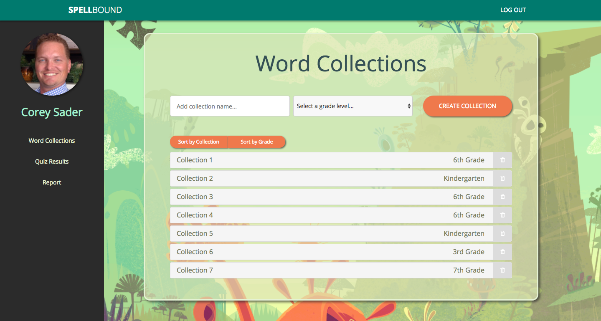
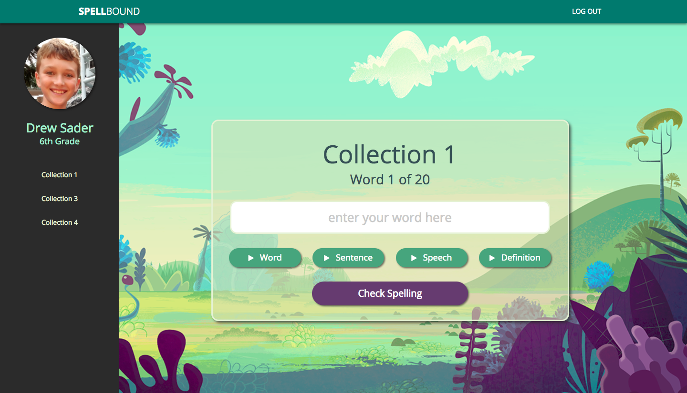
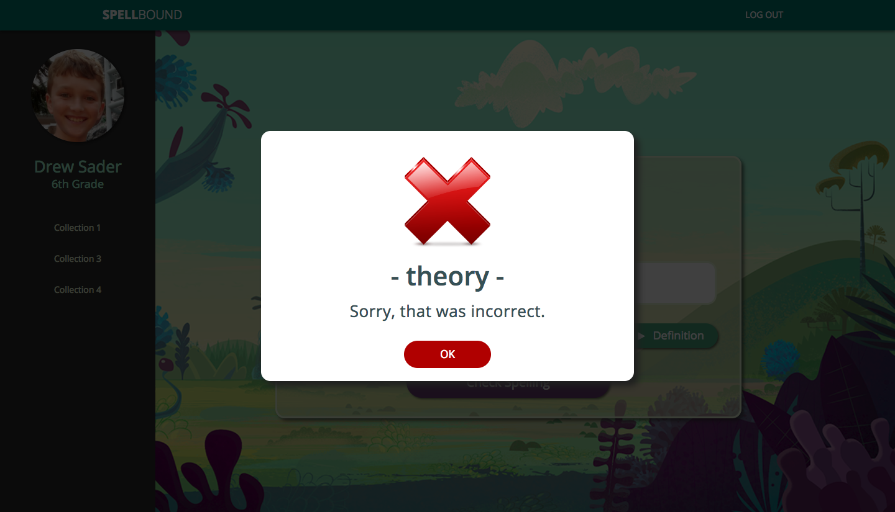
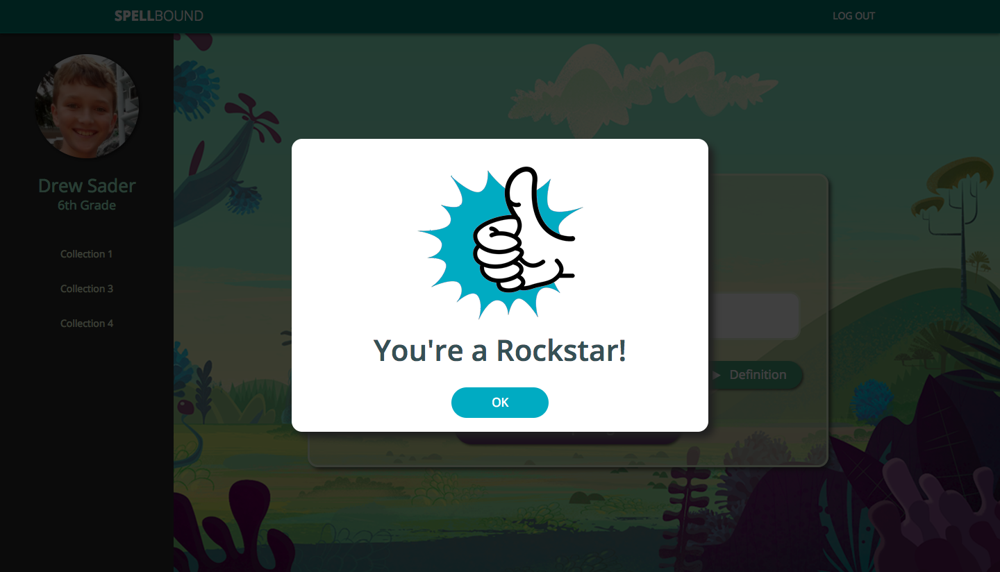
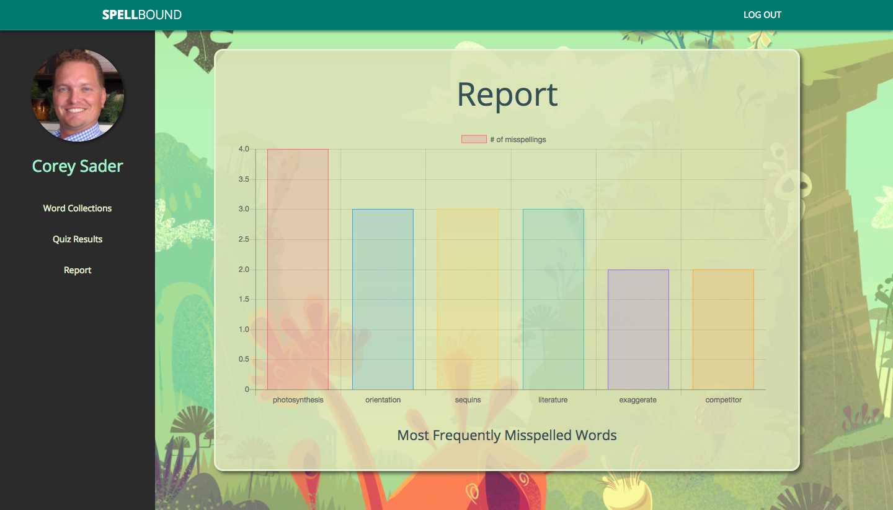

# Spellbound

Spellbound is an educational spelling application that frees children up to practice their teacher assigned spelling words when they have time.  Using text-to-speech each word is audibly read to the student.  They also have the option to listen to a sentence, part of speech and the definition (utilizing the WordNik api).

## Technology Used

* MEAN Stack
* MongoDB
* Express.js
* AngularJS
* Node.js
* HTML5
* CSS
* SASS
* JavaScript
* jquery
* Bootstrap
* Sweetalerts
* x editable
* WordNik Api (https://www.wordnik.com/)

## Why

### Problem/Solution:
I have two elementary school boys who bring home a list of spelling words (typically 20 words each) to practice for their upcoming bi-weekly quiz.  The problem is, with my wife and I's schedule, along with our boys after school activities and their daily homework, it's hard to find the time to sit down and study these words with them.

So my solution was to create an application that would allow me as a parent to create these collection of words and allow my boys to sit down when they have time (whether at home or in school) to practice their spelling.

The application also keeps track of their results by logging who took a quiz, which one, when and how well they did, as well as keep track of the words they've spelled incorrectly.  This allows us as parents to keep track of which words are causing them problems.

## Instructions

### Admin/Parent/Teacher

1. Start by creating an account.  When selecting your grade level, choose 'Teacher' or 'Parent'.
2. After creating your account, log in using your new credentials.
3. You'll then be taken to the your dashboard where you can create collections of words, view the results of quizzes taken, or view a report of the most frequently misspelled words.
4. To create a collection:
    1. Give it a name and select a grade level.
    2. Open the collection by clicking on it's name/grade level.
    3. You can then add as many words and sentences as needed.
        - text to speech isn't always that clear, so it's necessary to add a sentence that incorporates the word.

### Student

1. Start by creating an account.  When selecting your grade level, choose the grade your in or will be going into.
2. After creating your account, log in using your new credentials.
3. You'll then be taken to the your personal dashboard where you'll see all of the collections related to your grade level.
4. Select the quiz you wish to take.
5. Click 'Start Quiz'.
6. When the quiz starts you'll have the option to listen to the word, sentence, part of speech and definition.
7. When your ready click into the text input field and attempt to spell the word.  When finished, click the 'Check Spelling' button to see if you are correct.  Whether you're correct or incorrect you'll be taken to the next word.
8. After completing the quiz, click the 'Submit Quiz' button.
9. If you wish, you can take the quiz again or select another.

## Notes:

Created: July 2017
Duration: 2 week project

This was my first MEAN full-stack application.  Later I plan to add more functionality, as well as clean up the code.  Right now I'm only using one controller and service.  Eventually I'd like to brake these up into multiple controllers and services based on function.

The version deployed on Heroku (https://spellbound-soloapp.herokuapp.com/#!/) doesn't allow for the 'part of speech', or 'definition' at this time.  Heroku requires a secure https call...the WordNik api I'm using only uses an http call.  I'm looking into setting up this app using another api.  Updates to come.

